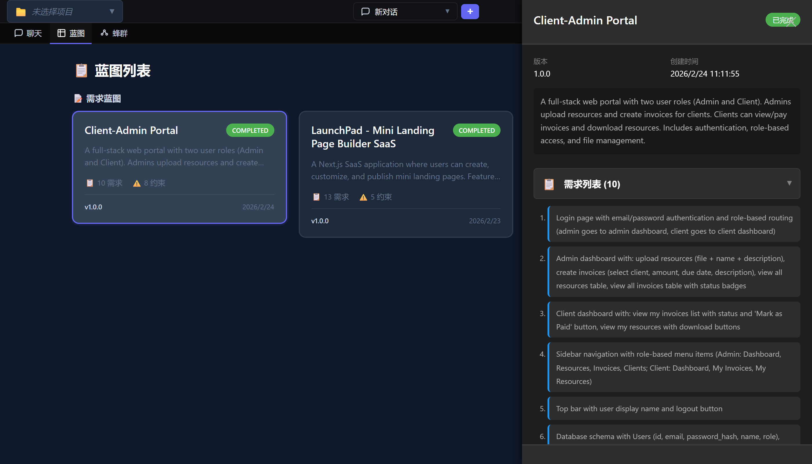
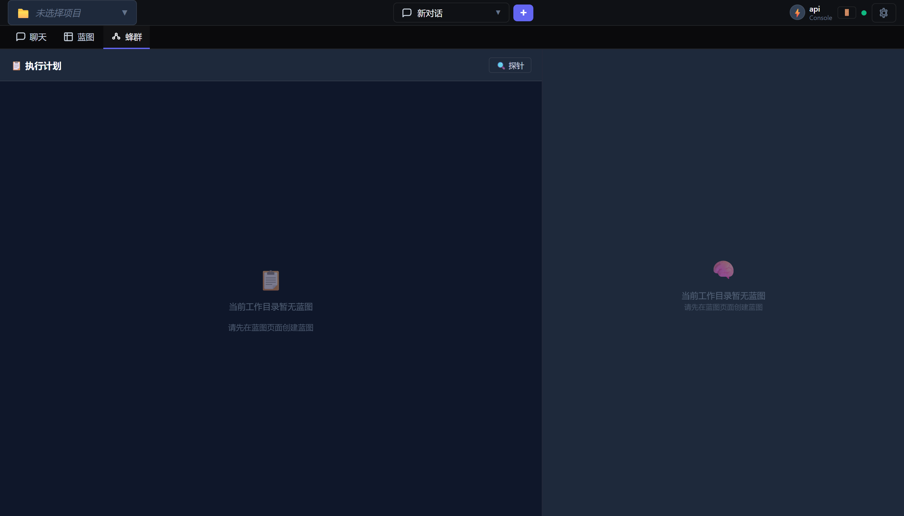

# Claude Code Open 操作手册

> 从零开始，手把手教你使用 Claude Code Open — 开源 AI 编程平台

[](http://voicegpt.site:3456/)
[](https://github.com/kill136/claude-code-open)

---

## 目录

- [一、什么是 Claude Code Open？](#一什么是-claude-code-open)
- [二、安装](#二安装)
  - [Windows 一键安装（推荐）](#windows-一键安装推荐)
  - [macOS / Linux 安装](#macos--linux-安装)
  - [Docker 部署](#docker-部署)
  - [手动安装（开发者）](#手动安装开发者)
- [三、首次配置](#三首次配置)
  - [获取 API Key](#获取-api-key)
  - [配置 API Key](#配置-api-key)
  - [选择模型](#选择模型)
- [四、Web UI 快速上手](#四web-ui-快速上手)
  - [界面总览](#界面总览)
  - [发送第一条消息](#发送第一条消息)
  - [权限模式说明](#权限模式说明)
  - [对话管理](#对话管理)
- [五、核心功能详解](#五核心功能详解)
  - [5.1 聊天对话](#51-聊天对话)
  - [5.2 代码视图](#52-代码视图)
  - [5.3 蓝图系统（Blueprint）](#53-蓝图系统blueprint)
  - [5.4 蜂群多 Agent 协作（Swarm）](#54-蜂群多-agent-协作swarm)
  - [5.5 定时任务](#55-定时任务)
  - [5.6 斜杠命令](#56-斜杠命令)
- [六、进阶用法](#六进阶用法)
  - [6.1 CLAUDE.md 项目规则](#61-claudemd-项目规则)
  - [6.2 Skills 技能系统](#62-skills-技能系统)
  - [6.3 MCP 协议扩展](#63-mcp-协议扩展)
  - [6.4 Hooks 钩子系统](#64-hooks-钩子系统)
  - [6.5 自我进化模式](#65-自我进化模式)
- [七、CLI 模式](#七cli-模式)
- [八、常见问题](#八常见问题)
- [九、获取帮助](#九获取帮助)

---

## 一、什么是 Claude Code Open？

Claude Code Open 是一个**开源的 AI 编程平台**，它把 Claude AI 变成一个能直接操作你电脑的编程助手——不只是聊天，它能：

- **直接读写你的代码文件**
- **运行终端命令**
- **搜索整个代码库**
- **操作浏览器**
- **管理 Git 仓库**
- **多个 AI Agent 协作完成复杂任务**

简单说：**它是一个住在你电脑里的全栈工程师**。


*Web UI 主界面 — 集聊天、代码编辑、蓝图规划于一体*

---

## 二、安装

### Windows 一键安装（推荐）

**最简单的方式——下载双击即可：**

1. 下载安装脚本：[install.bat](https://raw.githubusercontent.com/kill136/claude-code-open/private_web_ui/install.bat)
   - 国内加速：[Gitee 镜像](https://gitee.com/lubanbbs/claude-code-open/raw/private_web_ui/install.bat)
2. **双击运行** `install.bat`
3. 等待自动完成（安装 Node.js、依赖、构建前端）
4. 桌面出现 "Claude Code WebUI" 快捷方式，双击打开

> **安装完成后**：浏览器自动打开 `http://localhost:3456`，你就看到 Web UI 了。

### macOS / Linux 安装

一行命令搞定：

```bash
curl -fsSL https://raw.githubusercontent.com/kill136/claude-code-open/private_web_ui/install.sh | bash
```

国内镜像加速：
```bash
curl -fsSL https://gitee.com/lubanbbs/claude-code-open/raw/private_web_ui/install.sh | bash
```

### Docker 部署

```bash
# 构建镜像
docker build -t claude-code-open .

# 运行 Web UI
docker run -it \
  -e ANTHROPIC_API_KEY=你的API密钥 \
  -p 3456:3456 \
  -v $(pwd):/workspace \
  claude-code-open node /app/dist/web-cli.js --host 0.0.0.0
```

然后访问 `http://localhost:3456`。

### 手动安装（开发者）

```bash
git clone https://github.com/kill136/claude-code-open.git
cd claude-code-open
npm install

# 构建前端
cd src/web/client && npm install && npm run build && cd ../../..

# 构建后端
npm run build

# 启动 Web UI
npm run web
```

---

## 三、首次配置

### 获取 API Key

你需要一个 Anthropic API Key 来使用 Claude AI：

1. 访问 [console.anthropic.com](https://console.anthropic.com/)
2. 注册账号
3. 进入 **API Keys** 页面
4. 点击 **Create Key**，复制生成的密钥（以 `sk-ant-` 开头）

> **费用说明**：Anthropic API 按使用量计费。Haiku 模型最便宜，Opus 最贵但最聪明。新用户通常有免费额度。

### 配置 API Key

打开 Web UI 后，有 **3 种方式** 配置 API Key：

#### 方式一：通过 Web UI 设置（推荐）

1. 点击右上角 **齿轮图标** ⚙️ 打开设置
2. 点击左侧 **"API 高级"** 选项卡
3. 在 **API Key** 输入框粘贴你的密钥
4. （可选）修改 **API Base URL** 如果你使用代理/中转服务
5. 点击保存

#### 方式二：通过环境变量

```bash
# Linux / macOS
export ANTHROPIC_API_KEY=sk-ant-你的密钥

# Windows PowerShell
$env:ANTHROPIC_API_KEY="sk-ant-你的密钥"

# Windows CMD
set ANTHROPIC_API_KEY=sk-ant-你的密钥
```

#### 方式三：通过配置文件

编辑 `~/.claude/settings.json`：

```json
{
  "apiKey": "sk-ant-你的密钥"
}
```

### 选择模型

在输入框左下角的**模型下拉菜单**中选择：

| 模型 | 特点 | 适合场景 |
|------|------|----------|
| **Opus** | 最强大、最聪明 | 复杂架构设计、深度代码分析 |
| **Sonnet** | 性价比最高（推荐） | 日常编程、代码修改 |
| **Haiku** | 最快、最便宜 | 简单问答、快速搜索 |

> **建议**：日常使用选 **Sonnet**，遇到复杂问题切换到 **Opus**。

---

## 四、Web UI 快速上手

### 界面总览

Web UI 分为以下几个区域：

```
┌─────────────────────────────────────────────────┐
│  📁 项目选择    💬 会话选择   ➕  🔍  ⚙️ 设置  │  ← 顶部导航栏
├─────────────────────────────────────────────────┤
│  💬 聊天  📋 蓝图  🐝 蜂群  ⏰ 定时任务        │  ← 功能标签页
├─────────────────────────────────────────────────┤
│                                                 │
│              对话内容区域                          │
│                                                 │
├─────────────────────────────────────────────────┤
│  输入框   模型选择  权限模式  📎 🎤 ...          │  ← 底部工具栏
└─────────────────────────────────────────────────┘
```

**右上角功能按钮**（从左到右）：
- **🔗 API Console** — API 探针，查看请求详情
- **📁** / **≡** / **</>** — 切换对话视图、列表视图、代码视图

### 发送第一条消息

1. 在底部输入框输入你的问题，例如：
   ```
   帮我分析一下当前项目的目录结构
   ```
2. 点击 **发送** 按钮（或按 `Enter`）
3. AI 会开始分析并实时流式输出回复

**你可以让它做的事情**（示例）：

| 你说的话 | AI 做的事 |
|----------|-----------|
| "帮我读一下 src/index.ts" | 调用 Read 工具读取文件内容 |
| "在 utils.ts 里加个日期格式化函数" | 调用 Edit 工具直接修改代码 |
| "运行 npm test 看看测试结果" | 调用 Bash 工具执行命令 |
| "搜索项目里所有用到 useState 的地方" | 调用 Grep 工具搜索代码 |
| "帮我把这个 Bug 修了" | 综合使用多个工具分析并修复 |
| "帮我写个完整的用户认证模块" | 使用蓝图系统分解任务，多 Agent 协作完成 |

### 权限模式说明

底部工具栏有一个**权限模式**下拉菜单，控制 AI 操作文件的权限：

| 模式 | 图标 | 说明 |
|------|------|------|
| **询问** | 🔒 | 每次修改文件前都会问你确认（最安全） |
| **自动编辑** | 📝 | 自动执行文件编辑，但危险操作仍会询问 |
| **YOLO** | ⚡ | 全自动，不询问直接执行（高效但需要信任 AI） |
| **计划** | 📋 | AI 先制定计划让你审核，批准后再执行 |

> **新手建议**：先用"询问"模式熟悉 AI 的操作方式，之后根据信任程度提升到"自动编辑"。

### 对话管理

- **新建对话**：点击顶部 ➕ 按钮
- **切换对话**：点击顶部会话选择下拉菜单
- **搜索历史**：点击 🔍 或按 `Ctrl+K`
- **恢复上次**：在 CLI 模式下用 `--resume` 参数

---

## 五、核心功能详解

### 5.1 聊天对话

这是最基础的功能——和 AI 对话。但它不只是聊天，AI 可以**调用 37+ 种工具**来实际操作你的系统。

**对话中的工具调用**

当 AI 需要操作时，会展示工具调用的过程。例如当 AI 读取文件时，你会看到：

```
🔧 Read — 读取 src/index.ts
   ✅ 成功读取 245 行
```

**附件上传**

点击底部 📎 图标可以上传文件（图片、代码文件等），AI 能直接分析上传的内容。

**语音输入**

点击 🎤 图标开启语音识别，说出你的需求，自动转为文字发送。

### 5.2 代码视图

点击右上角 **</>** 图标切换到代码视图，类似 VS Code 的三栏布局：

```
┌──────────┬───────────────────┬──────────────┐
│  文件树   │    代码编辑器      │   对话面板    │
│          │  (Monaco Editor)  │              │
│  📁 src  │                   │  你: ...     │
│  📁 docs │   function foo()  │  AI: ...     │
│  📄 ...  │   { ... }         │              │
└──────────┴───────────────────┴──────────────┘
```

**功能**：
- **文件树** — 浏览和打开项目文件
- **Monaco Editor** — 语法高亮、多标签页编辑
- **AI 对话面板** — 边看代码边和 AI 讨论
- **右键菜单** — 选中代码后右键可以"Ask AI"

> **技巧**：在代码视图中选中一段代码，然后对 AI 说"解释这段代码"或"优化这段代码"，它能精准定位你选中的内容。

### 5.3 蓝图系统（Blueprint）

点击 **"蓝图"** 标签页进入蓝图系统。


*蓝图页面 — 可视化展示项目模块结构*

**什么是蓝图？**

蓝图是对项目的"全景扫描"——AI 分析你的整个代码库，识别出：
- 模块结构（32+ 个模块）
- 业务流程（6+ 个流程）
- 非功能需求

**使用场景**：
- 新接手一个项目，想快速了解架构
- 要做大型重构，需要先理解依赖关系
- 向团队成员介绍项目结构

**如何使用**：

在聊天中说：
```
帮我分析一下当前项目，生成蓝图
```

AI 会调用 `GenerateBlueprint` 工具，扫描代码后生成可视化蓝图。

### 5.4 蜂群多 Agent 协作（Swarm）

点击 **"蜂群"** 标签页进入蜂群面板。


*蜂群面板 — 多个 AI Agent 并行工作*

**什么是蜂群？**

当你有一个复杂的大任务（比如"帮我从零搭建一个电商后端"），单个 AI 处理太慢。蜂群系统会：

1. **Smart Planner** 分解任务为多个子任务
2. **Lead Agent** 分配任务给多个 Worker
3. 多个 **Worker Agent** 并行工作
4. **Reviewer** 检查每个 Worker 的产出质量

**如何触发**：

在聊天中描述一个复杂任务，AI 会自动判断是否需要蜂群协作。你也可以明确要求：
```
用蓝图系统帮我实现一个完整的用户管理模块，包含注册、登录、权限控制
```

蜂群面板左侧显示**任务列表和执行状态**，右侧显示 **Lead Agent 的对话过程**。

### 5.5 定时任务

点击 **"定时任务"** 标签页管理定时任务。

**功能**：
- **一次性任务** — "2小时后提醒我检查构建结果"
- **周期性任务** — "每天早上9点运行代码审查"
- **文件监控** — "当 src/ 目录有文件变动时自动运行测试"

**创建方式**：

方式一：在聊天中用自然语言：
```
帮我创建一个定时任务，每天上午10点检查 Git 仓库状态并生成报告
```

方式二：在定时任务页面点击 **"+ 新建任务"** 按钮。

**任务类型**：

| 类型 | 标签 | 说明 |
|------|------|------|
| `once` | 单次 | 在指定时间执行一次 |
| `interval` | 周期性 | 按固定间隔重复执行 |
| `watch` | 文件监控 | 监控文件变化自动触发 |

### 5.6 斜杠命令

在输入框输入 `/` 可以看到所有可用命令：

| 命令 | 说明 |
|------|------|
| `/help` | 显示帮助信息 |
| `/clear` | 清空当前对话 |
| `/compact` | 压缩对话历史（节省 Token） |
| `/status` | 查看当前会话状态 |
| `/model` | 查看/切换模型 |
| `/fast` | 切换快速模式 |
| `/tools` | 列出所有可用工具 |
| `/config` | 查看配置 |
| `/export` | 导出会话（JSON/Markdown） |
| `/resume` | 恢复之前的会话 |
| `/rename` | 重命名当前会话 |
| `/exit` | 退出 |

---

## 六、进阶用法

### 6.1 CLAUDE.md 项目规则

在项目根目录创建 `CLAUDE.md` 文件，写入你的项目规则和约束。AI 每次启动都会自动读取这个文件。

**这是最强大的配置手段**——相当于给 AI 员工一份"工作手册"。

**示例**：

```markdown
## 项目约定
- 使用 TypeScript strict 模式
- 所有组件用函数式写法，禁止 class 组件
- CSS 使用 Tailwind，不写内联样式
- 提交信息用中文，格式：`类型: 描述`

## 代码风格
- 缩进 2 空格
- 字符串用单引号
- 文件命名 kebab-case

## 禁止事项
- 不要动 package.json 的依赖版本
- 不要修改 .env 文件
- 不要"顺手优化"不相关的代码
```

> **关键理解**：每次新对话，AI 都是全新实例（没有记忆）。CLAUDE.md 是唯一跨对话持久生效的"规则约束"。

### 6.2 Skills 技能系统

Skills 是封装好的工作流，可以通过 `/` 命令一键触发。

**内置技能举例**：
- `/code-review` — 代码审查
- `/analyze-logs` — 分析运行日志
- `/skill-hub` — 搜索和安装社区技能

**创建自定义 Skill**：

在 `.claude/skills/my-skill/SKILL.md` 创建文件：

```yaml
---
description: "自动化部署到测试环境"
user-invocable: true
---

# 部署到测试环境

1. 运行 `npm run build` 构建项目
2. 运行 `npm test` 确保测试通过
3. 执行 `rsync -avz dist/ user@server:/app/`
4. 验证部署成功：`curl https://test.example.com/health`
```

然后在对话中输入 `/my-skill` 即可触发。

### 6.3 MCP 协议扩展

MCP (Model Context Protocol) 让 AI 能连接外部工具和服务。

**配置 MCP 服务器**：

编辑 `~/.claude/settings.json`：

```json
{
  "mcpServers": {
    "filesystem": {
      "type": "stdio",
      "command": "npx",
      "args": ["-y", "@modelcontextprotocol/server-filesystem", "/your/path"]
    },
    "github": {
      "type": "stdio",
      "command": "npx",
      "args": ["-y", "@modelcontextprotocol/server-github"],
      "env": {
        "GITHUB_TOKEN": "你的 GitHub Token"
      }
    }
  }
}
```

或者在 Web UI 设置页面的 **"MCP"** 选项卡中配置。

**常用 MCP 服务器**：
- `@modelcontextprotocol/server-filesystem` — 文件系统访问
- `@modelcontextprotocol/server-github` — GitHub 操作
- `@modelcontextprotocol/server-slack` — Slack 消息
- `@modelcontextprotocol/server-postgres` — PostgreSQL 数据库

### 6.4 Hooks 钩子系统

Hooks 让你在 AI 的工具调用前后自动执行自定义脚本。

**配置示例**（在 `~/.claude/settings.json`）：

```json
{
  "hooks": [
    {
      "event": "PreToolUse",
      "matcher": "Bash",
      "command": "echo '即将执行命令...'",
      "blocking": true
    },
    {
      "event": "PostToolUse",
      "matcher": "Write",
      "command": "npx prettier --write ${FILE_PATH}",
      "blocking": false
    }
  ]
}
```

**Hook 事件类型**：

| 事件 | 触发时机 |
|------|----------|
| `PreToolUse` | 工具调用前 |
| `PostToolUse` | 工具调用后 |
| `PrePromptSubmit` | 用户发消息前 |
| `PostPromptSubmit` | 用户发消息后 |
| `Notification` | AI 发通知时 |
| `Stop` | AI 停止响应时 |

### 6.5 自我进化模式

这是最独特的功能——**AI 可以修改自己的代码**。

```bash
npm run web:evolve
```

启用后，AI 可以：
- 阅读自己的源代码
- 修改系统提示词、工具逻辑
- 添加新工具
- 安装 MCP 服务器
- 热重载自动生效

> **安全机制**：每次修改前会运行 TypeScript 编译检查，确保不会搞坏自己。

---

## 七、CLI 模式

除了 Web UI，你也可以在终端中使用命令行模式：

```bash
# 交互式对话
node dist/cli.js

# 带初始问题
node dist/cli.js "帮我分析这个项目"

# 打印模式（非交互，适合脚本）
node dist/cli.js -p "解释一下 src/index.ts"

# 指定模型
node dist/cli.js -m sonnet "简单问题用便宜模型"

# 恢复上次对话
node dist/cli.js --resume

# 列出历史对话
node dist/cli.js --list
```

---

## 八、常见问题

### Q: API Key 报错 "Invalid API Key"

**排查步骤**：
1. 确认密钥以 `sk-ant-` 开头
2. 检查是否有多余的空格或换行
3. 确认 Anthropic 账号有可用余额
4. 如果用代理，检查 `ANTHROPIC_BASE_URL` 是否正确

### Q: 安装时 `npm install` 报错

**常见原因**：
- Node.js 版本低于 18，运行 `node -v` 检查
- 网络问题，尝试设置 npm 镜像：`npm config set registry https://registry.npmmirror.com`
- Windows 原生编译失败，通常不影响使用（预编译二进制会自动下载）

### Q: Web UI 打开是空白页

**排查步骤**：
1. 确认前端已构建：`ls src/web/client/dist/`
2. 如果没有 dist 目录，运行 `cd src/web/client && npm run build`
3. 检查终端有无报错信息

### Q: AI 回复很慢

- 切换到 **Haiku** 模型（最快）
- 使用 `/compact` 压缩对话历史
- 检查网络连接，必要时配置代理

### Q: 如何使用中转 API / 第三方 API

在设置页面的 "API 高级" 中修改 **API Base URL**，例如：
```
https://your-proxy.com/v1
```

支持任何兼容 Anthropic API 格式的服务。

### Q: AI 修改了不该改的文件

- 使用 **"询问"** 权限模式，每次修改前确认
- 在 CLAUDE.md 中明确写入"禁止修改 xxx"
- 使用 Git，随时可以 `git checkout -- .` 回滚

---

## 九、获取帮助

- **GitHub Issues**: [提交问题](https://github.com/kill136/claude-code-open/issues)
- **Discord 社区**: [加入讨论](https://discord.gg/bNyJKk6PVZ)
- **在线体验**: [Live Demo](http://voicegpt.site:3456/)
- **项目官网**: [chatbi.site](https://www.chatbi.site)

---

## 附录：37+ 工具速查表

| 工具 | 用途 | 示例 |
|------|------|------|
| **Read** | 读文件 | "帮我读 src/index.ts" |
| **Write** | 写文件 | "创建一个 utils.ts 文件" |
| **Edit** | 改文件 | "把函数名从 foo 改成 bar" |
| **Bash** | 执行命令 | "运行 npm test" |
| **Glob** | 搜文件名 | "找出所有 .tsx 文件" |
| **Grep** | 搜内容 | "搜索所有用到 useState 的地方" |
| **WebFetch** | 抓网页 | "帮我看一下这个文档网站" |
| **WebSearch** | 搜索网络 | "搜索 React 19 新特性" |
| **Browser** | 操作浏览器 | "打开 localhost:3000 截个图" |
| **Task** | 子Agent | "深入分析这段代码的依赖关系" |
| **LSP** | 代码智能 | "跳转到这个函数的定义" |
| **GenerateBlueprint** | 生成蓝图 | "帮我分析项目全景" |
| **StartLeadAgent** | 多Agent协作 | "用蜂群模式完成这个大任务" |
| **ScheduleTask** | 定时任务 | "每天9点检查代码质量" |
| **NotebookEdit** | 编辑Notebook | "修改 Jupyter 的第3个单元格" |
| **SelfEvolve** | 自我进化 | "给自己加个新工具" |

---

*本手册最后更新：2026-02-26*

*Claude Code Open — 让 AI 不只是聊天，而是真正帮你干活*
